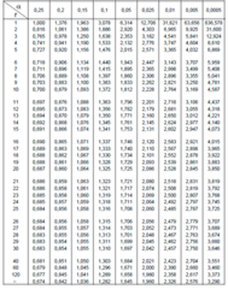
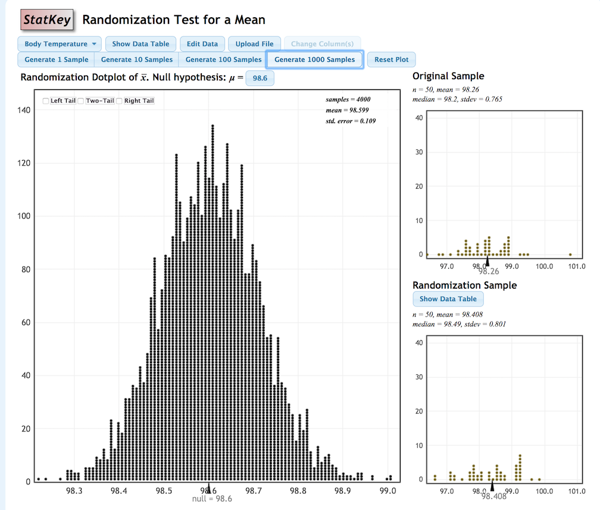
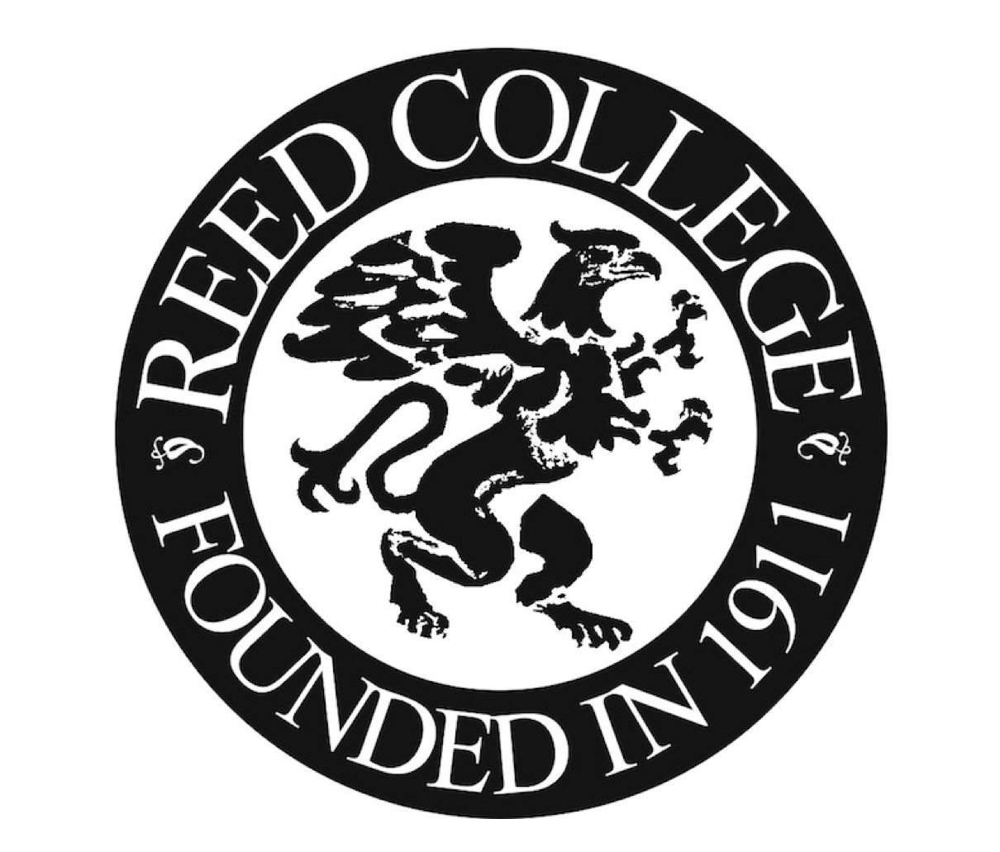
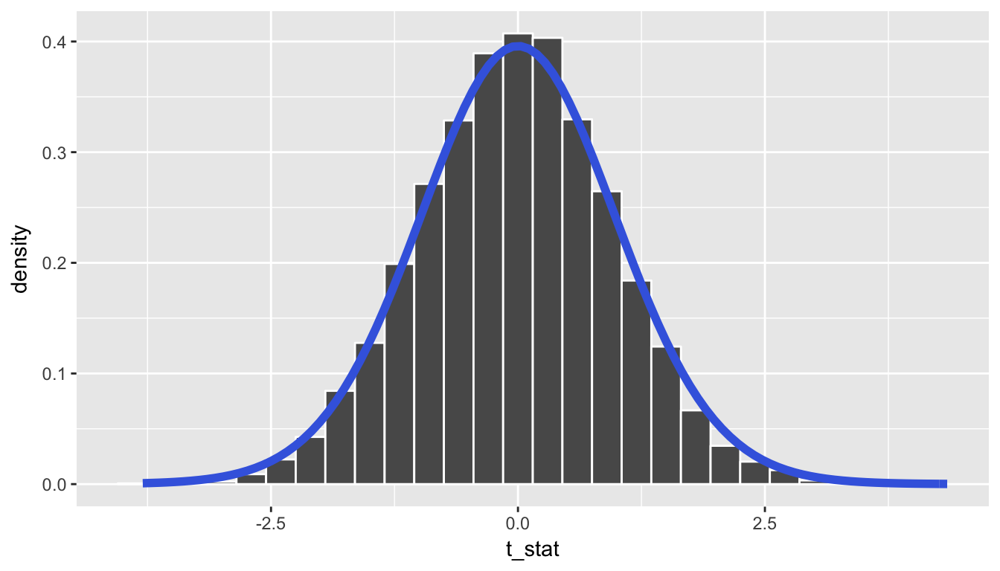
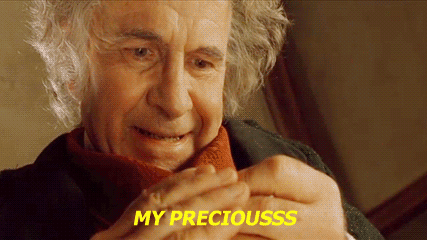
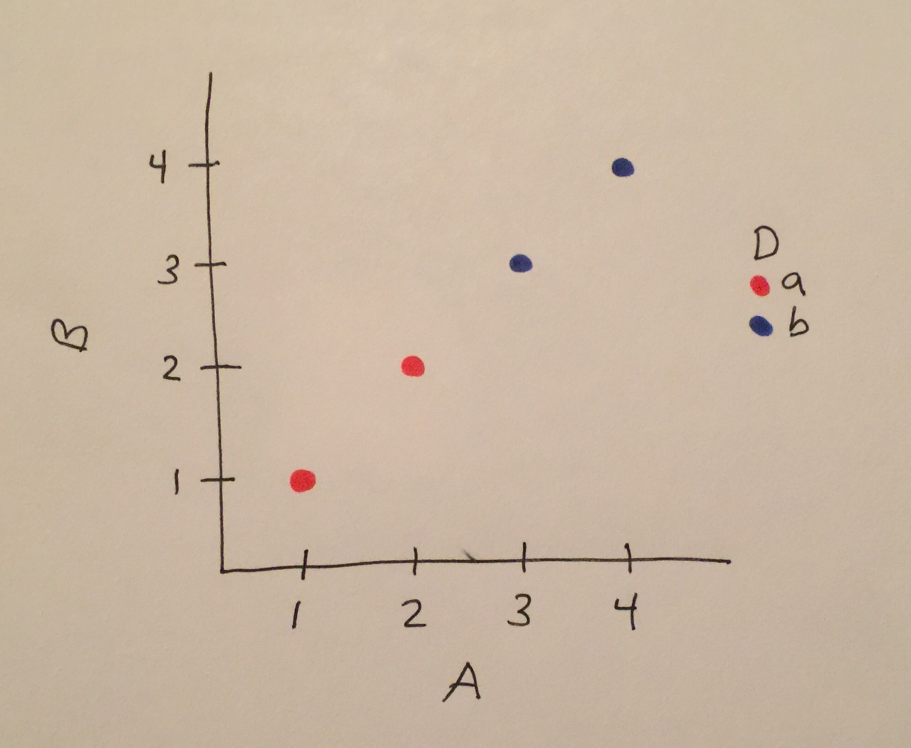
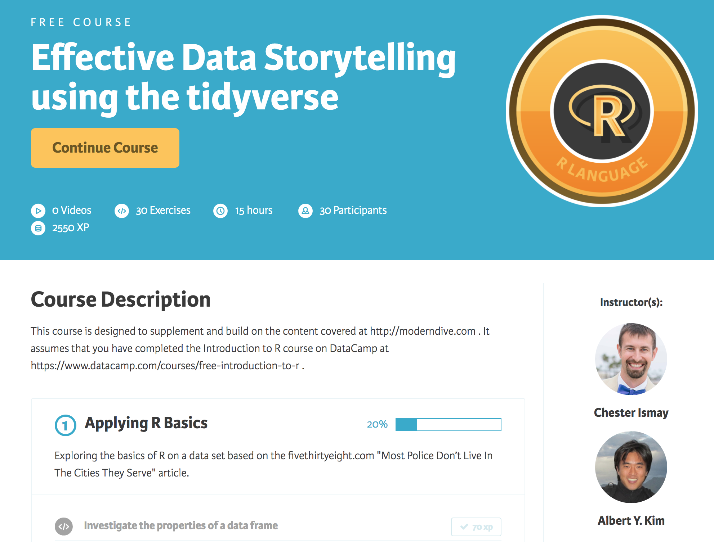
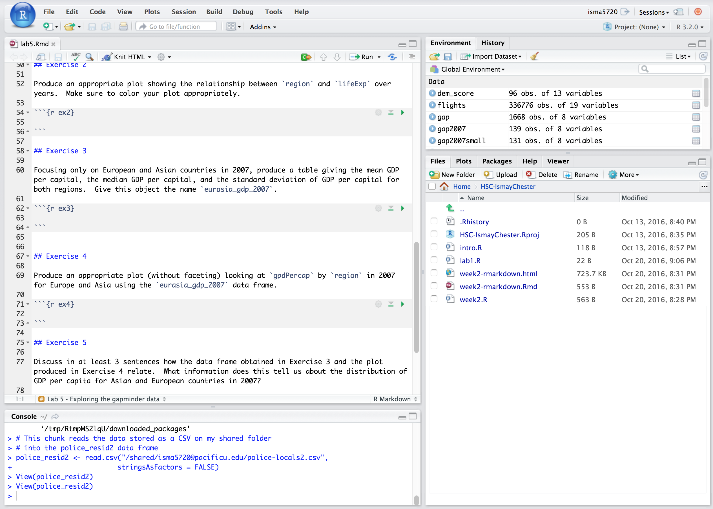
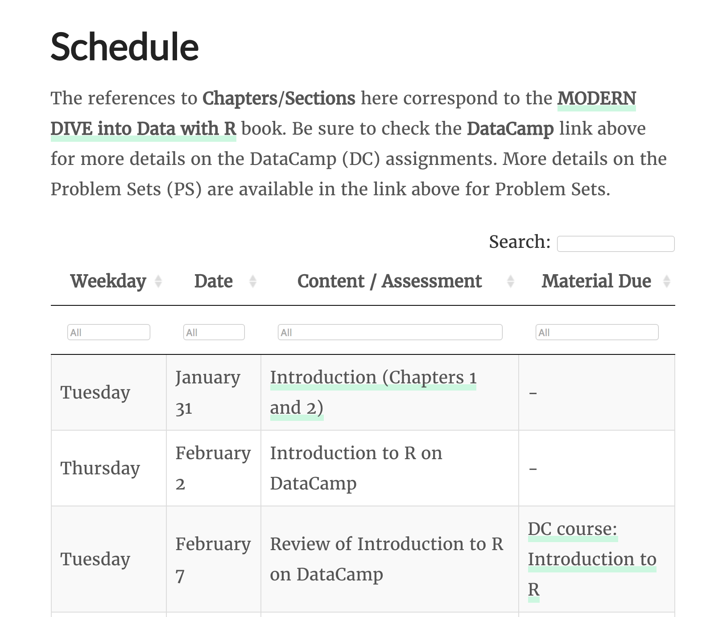

layout: true

.footer[These slides available at <http://bit.ly/OTEN17>]

<!--
Statistics textbooks are expensive; proprietary statistical software is often even worse. I’ll discuss my use in teaching of and creation of open-source tools designed to provide better resources.

The bookdown R package has allowed for resources to be freely available while also encouraging collaboration and reproducible analyses. It allows one to write just one source document and export to HTML, PDF, and ebook formats. As examples, this package can be used to create textbooks that include GIFs and videos for students to follow along with while using RStudio, to show R code and its results, and to easily update your resource as you need. In this talk, I’ll discuss how I created an open source textbook for my Social Statistics course (available at http://ismayc.github.io/moderndiver-book ) and feedback I received from my students this past semester on using it.

I’ll also discuss why I believe everyone should be using modern R packages in their introductory statistics course and how this textbook can be used as a guide for doing just that. Instructor resources are in development and will be available to further support open access to a modern introductory statistics curriculum. I’m hoping this provides the scientific community with a guide to how you could incorporate modern R packages into your classes and why it is so important to teach your students introductory statistics as an introduction to the practice of reproducible statistical analysis. I’ll also demonstrate how I used an RStudio Server environment with my students that helped with error checking, trouble-shooting, and group projects. Lastly, I hope to convince you that programming is nowhere near as intimidating as you may think it to be and that it really should be a skill that we should be teaching all students, especially those in the scientific fields. The tools that enable us to teach it are improving exponentially and now is the time to get ahead of the curve as we encourage reproducible analysis and embrace open-source tools in education.
-->

---


## My story teaching Intro Stats - Grad school

```{r setup, include=FALSE}
# devtools::install_github("yihui/xaringan")
library(tidyverse)
library(knitr)
library(magick)
library(magrittr)
library(okcupiddata)
data(profiles)
options(htmltools.dir.version = FALSE)
knitr::opts_chunk$set(echo = FALSE)
```

<center>
<a href="https://upload.wikimedia.org/wikipedia/commons/2/2d/NAU_Lumberjacks_wordmark.png"></a> <br><br><br> <a href="https://upload.wikimedia.org/wikipedia/commons/b/b3/Arizona_State_University_logo.svg"> </a>
</center>

---

## My story teaching Intro Stats -  Grad school

<center>
<a href="https://upload.wikimedia.org/wikipedia/commons/2/24/TI-30XIIS.JPG"></a> &emsp;&emsp; <a href="https://upload.wikimedia.org/wikipedia/commons/thumb/b/bd/Tabla_t.png/189px-Tabla_t.png"> </a>
</center>

---

## My story teaching Intro Stats

### Tenure-track stats prof

<center>
<a href="https://commons.wikimedia.org/wiki/File:Harwood_Memorial_Union,_Ripon_College_view_4.jpg"> </a>
</center>

---

## My story teaching Intro Stats

### Tenure-track stats prof

<center>
<a href="http://www.lock5stat.com/StatKey/"> </a>
</center>

---

class: center, middle

# But something was missing...

---

class: center, middle

```{r out.width="93%"}

```

---

class: center, middle

```{r}
reed <- image_read("images/reed2.png")
r_logo <- image_read("images/Rlogo.png")
r_logo_tiny <- image_rotate(image_scale(image_background(r_logo, "none"), "x80"), 280)
r_in_reed <- image_composite(image_scale(reed, "x400"), r_logo_tiny, offset = "+26+135")
image_write(r_in_reed, "images/magick/r_in_reed.png", format = "png")
include_graphics("images/magick/r_in_reed.png", dpi = 65)
```

---

# My story teaching Intro Stats


<a href="https://www.pacificu.edu/sites/default/files/Images/PacU_Logo_RGB_000.jpg"></a> <br> &emsp;&emsp; &emsp;&emsp; &emsp;&emsp; &emsp;&emsp; &emsp;&emsp; &emsp;&emsp; &emsp;&emsp; <a href="http://giphy.com/gifs/sherlock-bbc-one-l0MYM98IwMYDIn1fO"> </a>

---

class: center, middle

# ModernDive

## An Introduction to Statistical and Data Sciences via R

***

Authors:  Chester Ismay, Albert Y. Kim and **you**?

## [ModernDive.com](http://moderndive.com)

OR

## [ModernDive.org]((http://moderndive.com)

---

class: center, middle

# Why is this needed?

---

## Guiding Principles of ModernDive

## 1. Blur the lines between lecture and lab

<center>
<a href="https://giphy.com/gifs/JIX9t2j0ZTN9S"> </a>
</center>

---

## 2. Focus on the data/science research pipeline

```{r out.width="100%"}
knitr::include_graphics("images/hadley.png")
```

---

## 3. It's all about the data

### - Use the [`tidyverse`](http://tidyverse.org/) with rich, interesting, open data sets

```{r out.width="100%", fig.align='center'}
gg <- image_read("images/ggplot2.png") %>% 
  image_background("none")
dpl <- image_read("images/dplyr.png") %>% 
  image_background("none")
br <- image_read("images/broom.png") %>% 
  image_background("none")
rmd <- image_read("images/rmarkdown.png") %>% 
  image_background("none")
rs <- image_read("images/rstudio.png") %>% 
  image_background("none")
hex <- c(gg, dpl, br, rmd, rs)
hex_side <- image_append(hex)
image_write(hex_side, "images/magick/hex_side.png", format = "png")
knitr::include_graphics("images/magick/hex_side.png", dpi = 50)
```

```{r eval=FALSE, echo=TRUE}
library(nycflights13)
library(ggplot2movies)
library(okcupiddata)
library(gapminder)
library(babynames)
```


---

## 4. Use simulation/resampling not probability/large sample approximation

### - Reinforce concepts, not equations, formulas, & probability tables

<!--
### - Have data visualization be the driver
-->

```{r, fig.align="center", out.width="85%"}

```

---

## 4. Use simulation/resampling not probability/large sample approximation

### - Reinforce concepts, not equations, formulas, and probability tables

### - Have data visualization be the driver


<center>
<a href="http://allendowney.blogspot.com/2016/06/there-is-still-only-one-test.html"> </a>
</center>

---


## 5. Don’t fence off students from the computation pool, throw them in!

### - Scaffold & support as a good foreign language professor would

<center>
<a href="http://giphy.com/gifs/pool-diving-synchronized-swimming-pDWtwK7D2IlFu"> </a>
</center>


---

## 6. Complete reproducibility with `bookdown`

### - Put it all out there

### - Ultimately the best textbook is one you’ve written yourself

<center>
<a href="http://giphy.com/gifs/oskouioskoui-lotr-gifscapade-3oFyCVxsQn6RBa0r5u"> </a>
</center>

---

class: center, middle

# Teaching R programming

---

## Introducing students to <small>`ggplot2`</small>

```{r}
simple_ex <- data_frame(
    A = c(1, 2, 3, 4),
    B = c(1, 2, 3, 4),
    C = c(3, 2, 1, 2),
    D = c("a", "a", "b", "b")
  )
```

```{r echo=TRUE, eval=FALSE}
ggplot(data = simple_ex, mapping = aes(x = A, y = B)) + 
  geom_point()
```

---

## Teaching the Grammar of Graphics via "chalk talk"

```{r}
simple_ex <- data_frame(
    A = c(1, 2, 3, 4),
    B = c(1, 2, 3, 4),
    C = c(3, 2, 1, 2),
    D = c("a", "a", "b", "b")
  )
```

```{r echo=TRUE, eval=FALSE}
ggplot(data = simple_ex, mapping = aes(x = A, y = B)) + 
  geom_point()
```

```{r out.width="85%", fig.align="center"}
include_graphics("images/basic1.png")
```


---

## Teaching the Grammar of Graphics via "chalk talk"

```{r, eval=FALSE, echo=TRUE}
ggplot(data = simple_ex, mapping = aes(x = A, y = B, color = D)) + 
  geom_point()
```

```{r out.width="85%", fig.align="center"}
include_graphics("images/basic1.png")
```


---

## Teaching the Grammar of Graphics via chalk talk

```{r, eval=FALSE, echo=TRUE}
ggplot(data = simple_ex, mapping = aes(x = A, y = B, color = D)) + 
  geom_point()
```


```{r out.width="60%", fig.align="center"}

```


---

## Summarizing diagrams

```{r out.width="87%", fig.align="center"}
include_graphics("images/dplyrchalk.png")
```


---

## Reverse engineering

### - What code is needed to produce this plot using the `profiles` data frame in `okcupiddata`?

```{r fig.width = 9, fig.height = 5}
profiles %>% 
  filter(between(age, 20, 50)) %>% 
  ggplot(mapping = aes(x = status, y = age)) +
  geom_boxplot() +
  facet_wrap(~sex) +
  coord_flip() +
  labs(y = "20 < age < 50", x = "status\n") +
  theme(text = element_text(size = 25))
```

<!--
- What effective data stories can you tell with this data based on the distributions above for males and females?
-->

---

## The `bookdown` R package

### - Rapid iteration and easily-updateable
###  - Exports book to multiple formats
###  - Slick cross-references
###  - Textbook has versions not editions
###  - Wikipedia model for intro stats/data science

---

# Finding great, interesting, accessible data sets is hard

<center>
<a href="http://giphy.com/gifs/justin-g-angry-better-call-saul-exasperation-26tnnpcYVRNJGlHy0"> </a>
</center>


---

class: center, middle

# Our recently released [<small>`fivethirtyeight`</small>](http://blog.revolutionanalytics.com/2017/01/the-fivethirtyeight-r-package.html) <br> R package

<center>
<a href="http://giphy.com/gifs/lil-jon-FBXSMK6fp3kQ"> </a>
</center>

---

## Features of [<small>`fivethirtyeight`</small>](https://cran.r-project.org/web/packages/fivethirtyeight/vignettes/fivethirtyeight.html)  

- Data sets that balance being
    - *rich enough* to answer meaningful questions with, 
    - *real enough* to ensure that there is context, and 
    - *realistic enough* to convey to students that data as it exists "in the wild" often needs processing.
- Easily and quickly accessible to novices, so that we [minimize the prerequisites to research](https://arxiv.org/abs/1507.05346).

---

## Features of [<small>`fivethirtyeight`</small>](https://CRAN.R-project.org/package=fivethirtyeight)  

```{r eval=FALSE, echo=TRUE}
library(fivethirtyeight)
data(police_locals)
```


<center>
<a href="https://fivethirtyeight.com/datalab/most-police-dont-live-in-the-cities-they-serve/"> </a>
</center>


---

## DataCamp course

<center>
<a href="https://www.datacamp.com/courses/effective-data-storytelling-using-the-tidyverse"> </a>
</center>


---

## RStudio Server

<center>

</center>


---

## [My Social Statistics course webpage](https://ismayc.github.io/soc301_s2017/)


<center>
<a href="https://ismayc.github.io/soc301_s2017/schedule/"> </a>
</center>


---

## What's to come

- Add more interactive shiny apps into the book

- Create more Review Questions at chapter ends using <small>`fivethirtyeight`</small> and other open data sources

- Design and share instructor resources

- Finish DataCamp course to supplement and assist with more immediate feedback

---

# [ModernDive.com](http://www.moderndive.com)

- <small>Slides created via the R package [**xaringan**](https://github.com/yihui/xaringan) by Yihui Xie.</small>

- <small>Fork our GitHub repository at <br> <https://github.com/ismayc/moderndiver-book></small>

    - <small>Feel free to modify the book as you wish for your own needs! Just please list the authors as "Chester Ismay, Albert Y. Kim, and **YOU**!"</small>

- <small>Fill out form to receive updates using [MailChimp](http://eepurl.com/cBkItf)</small>

- <small>Email us at <chester@moderndive.com> or <albert@moderndive.com></small>


